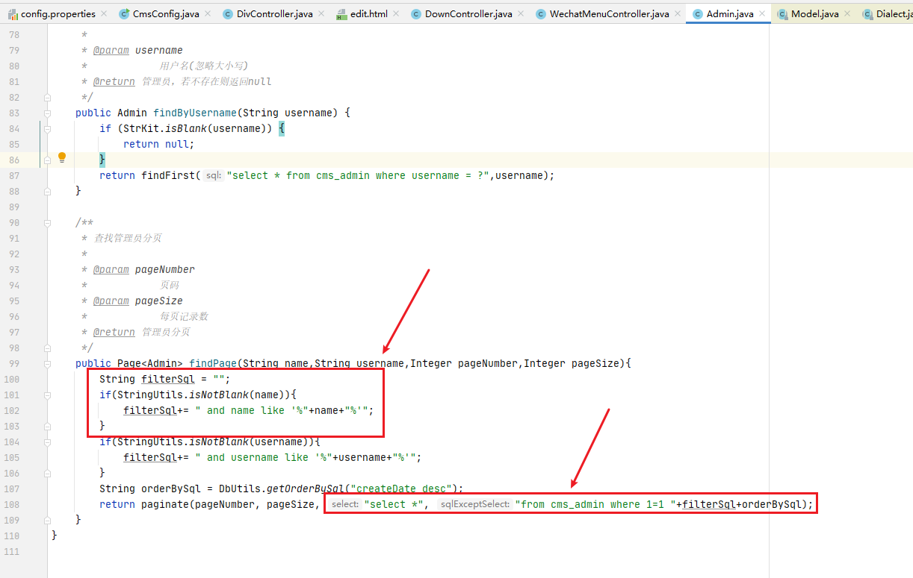
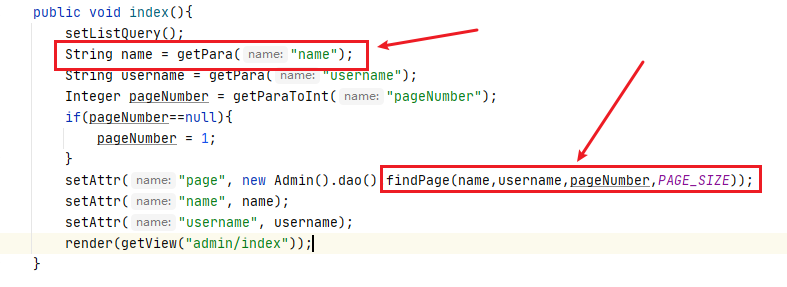
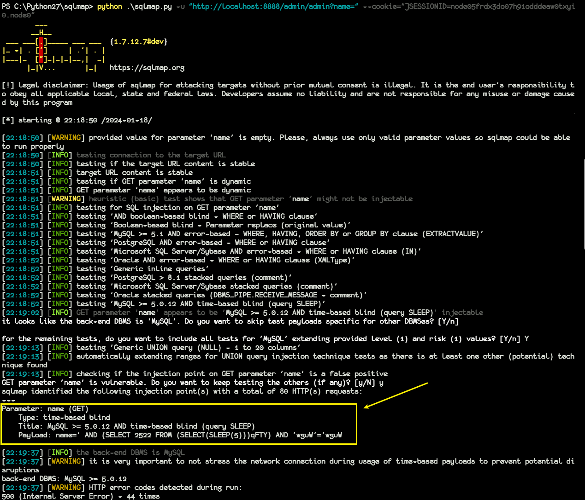
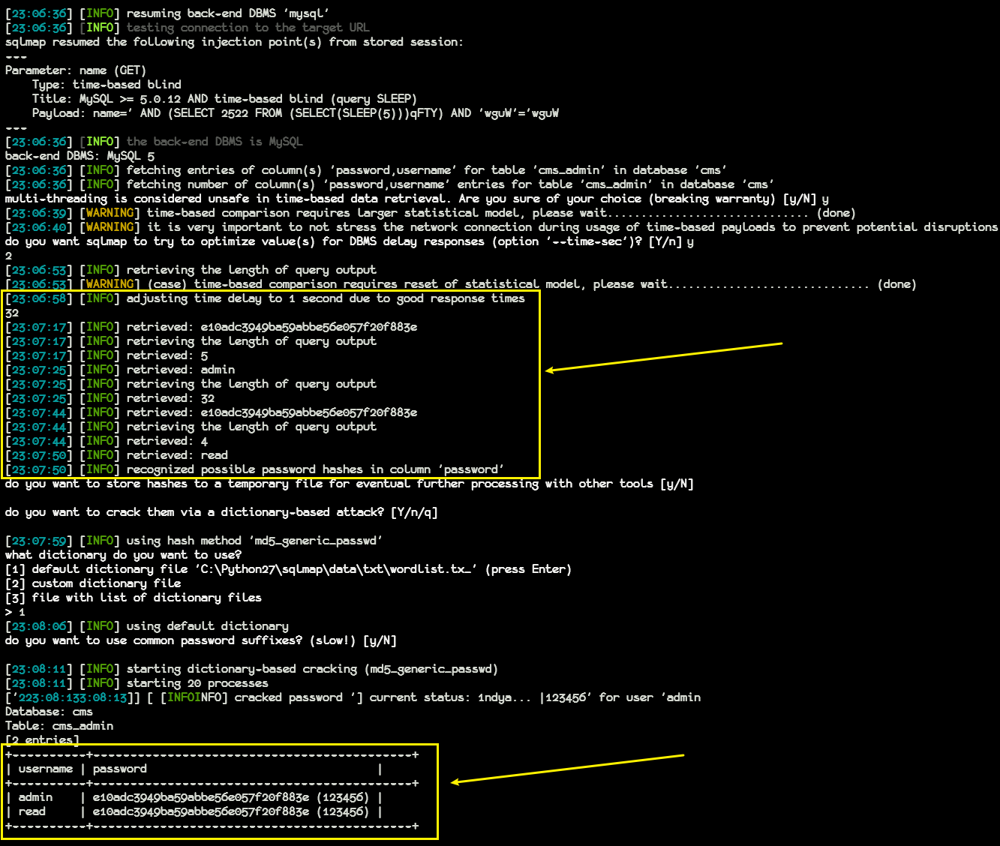

**target**:https://gitee.com/heyewei/JFinalcms

version: v5.0.0

 A SQL injection vulnerability exists in the /admin/admin interface.  
A SQL injection vulnerability exists in JFinalcms via  /admin/admin name parameter, which can be directly concatenated into an SQL statement from the frontend.

The AdminControl module passes to the findPage function without any string filtering after receiving the name parameter, which leads to the generation of sql injection:

Payload: ` name=' AND (SELECT 2522 FROM (SELECT(SLEEP(5)))qFTY) AND 'wguW'='wguW`

As shown in the figure below, sensitive user information stored in the database can be obtained by using sql injection attacks:

